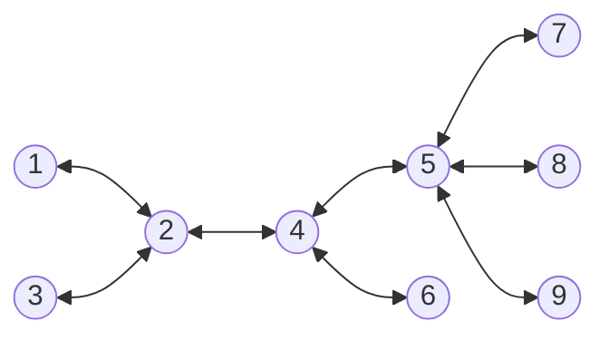

# *Logical Clock in **D**istributed **L**edger **T**echnology* (**DLT**)

**D**distributed **L**edger **T**echnology (**DLT**) is a new data storage paradigm that provides information distribution across many computers (***nodes***) in the network.

In other words, any **D**istributed **L**edger (**DL**) is a distributed information system that provides accumulating and storing information and guarantees

- immutability,
- availability, and
- consistency

of the stored information.

This understanding of DL focuses our research on the following issues.

1. The network topology of DL.
2. Specificity to communicate network nodes.
3. Local behavior of each network node.

## Network Topology

> A ***network topology*** is defined by
>
>- a finite set $P$ of nodes which contains at least two members,
>- a function $\mathrm{addressees}: P\rightarrow 2^P$ that associates the set of addressee nodes with each node.
>
> It is assumed that the following constraints
>
> - for any $n\in P$, $n\notin\mathrm{addressees}(n)$;
> - ***connectivity:*** for any $n'\neq n''\in P$, there exist $n_k\in P,\ k=1,\ldots,m$ where $m \geq 2$ such that
>    - $n_1=n'$ and $n_m=n''$;
>    - $n_{k+1}\in\mathrm{addressees}(n_k)$ for all $k=1,\ldots,m-1$.

> If a network topology satisfies the constraint
>
> - for any $n'\neq n''\in P$, $n'\in\mathrm{addressees}(n'')$ implies $n''\in\mathrm{addressees}(n')$
>
> then the network is called ***unoriented***.

## Examples of Networks

### An Oriented Ring

### An Unoriented Ring

### An Unoriented Tree

A network topology is ***unoriented tree-like*** if for any $n',n''\in P$, there exists exactly one sequence $n_k\in P$, $k=1,\ldots,m$ such that

- $n_1=n'$ and $n_m=n''$;
- for any $1\leq k<l\leq m$, $n_k\neq n_l$;
- for any $k=1,\ldots,m-1$, $n_{k+1}\in\mathrm{addressees}(n_k)$ .

## Communication of Network Nodes

It is assumed that network nodes communicate only by message passing.